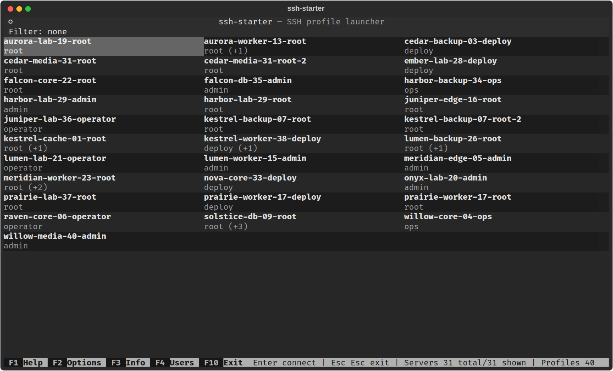

# ssh-starter

`ssh-starter` is a full-screen Textual TUI for launching SSH profiles from an OpenSSH config.

It scans `~/.ssh/config` by default, groups concrete `Host` aliases by visible server target (`HostName`/alias + port), shows those groups in a three-column grid using the default profile alias as the caption, and starts the real `ssh` command after a profile is selected.

The three grid columns automatically resize to the current terminal width. The UI is designed for vertical scrolling only; tables fit horizontally into the visible terminal width. The status line shows compact key hints. Mouse selection is supported when the terminal forwards mouse events.

`ssh-starter` works on Linux and Windows with Python 3.11+ and OpenSSH available on `PATH`.



## Tool installation

For normal use, install `ssh-starter` as a Python tool.

With `uv tool`:

```bash
uv tool install ssh-starter
```

With `pipx`:

```bash
pipx install ssh-starter
```

Then run:

```bash
ssh-starter
```

The package exposes the console command `ssh-starter`.

Upgrade commands:

```bash
uv tool upgrade ssh-starter
pipx upgrade ssh-starter
```

Install directly from GitHub before a PyPI release is available:

```bash
uv tool install "git+ssh://git@github.com/mykolarudenko/ssh-starter.git"
pipx install "git+ssh://git@github.com/mykolarudenko/ssh-starter.git"
```

## Local development setup

```bash
./setup.sh
```

The setup script recreates `.venv` and installs project dependencies with `uv sync`.

## Local development command symlink

```bash
./install.sh
```

The install script creates or updates this symlink:

```text
~/.local/bin/gossh -> <project>/run-app.sh
```

This is the personal/local development command alias. Packaged `pipx` and `uv tool`
installs expose `ssh-starter`, not `gossh`.

It does not run setup. If dependencies are missing, run `./setup.sh` first.

Make sure `~/.local/bin` is in `PATH`.

## Run

```bash
ssh-starter
```

Or for local development without the personal symlink:

```bash
./run-app.sh
```

Use another SSH config file:

```bash
ssh-starter --config /path/to/ssh_config
```

Print the command instead of executing SSH after selection:

```bash
ssh-starter --dry-run
```

Before opening the full-screen UI, `ssh-starter` checks that the selected OpenSSH config file exists and has at least one non-comment line.

- If the config file is missing, `ssh-starter` prints the missing path and exits.
- If the config file is empty or contains only comments, `ssh-starter` asks whether to create a sample profile.

Sample profile:

```sshconfig
Host sample-server
    HostName 192.0.2.10
    User deploy
    Port 22
```

After creating the sample, edit it for a real server and run `ssh-starter` again.

The default OpenSSH user config path is `~/.ssh/config`.
On Windows, Python expands `~` to the current user profile, so this resolves to a path like:

```text
C:\Users\<user>\.ssh\config
```

## Keys

- `Enter` — connect to the selected server with its default profile.
- `F4` — open the user/profile picker for the selected server.
- `Shift+Enter` — also opens the picker when the terminal reports it distinctly from plain `Enter`.
- `Ctrl+Enter` — also accepted when the terminal passes it through. Some terminals encode modified Enter keys as `Ctrl+J`, `Ctrl+M`, or `Ctrl+@`; `ssh-starter` handles those too.
- `F1` — open help.
- `F2` — open options.
- `F3` — show details for the selected server's default profile.
- `F10` — exit.
- `Esc Esc` — exit from the main menu when no filter is active.
- After an SSH session ends, `Space` or `Esc` returns to the main menu.
- Alphanumeric keys — quick search.
- `-`, `_`, `.`, `@` — also accepted in quick search because SSH aliases often contain them.
- `Backspace` — remove one search character.
- `Esc` — clear the current search filter.

The status line shows total discovered servers, visible filtered servers, profile count, the current filter, and compact key hints including exit shortcuts.
The bottom `F1`/`F2`/`F3`/`F4`/`F10` shortcut labels are clickable when mouse events are enabled.

## Options

Press `F2` from the main menu to edit options.

Current option:

- SSH `TERM` string for launched sessions.

Default:

```toml
term_string = "xterm-256color"
```

The chosen value is written to `config.toml` and is passed to the foreground SSH process as the `TERM` environment variable.

## Grouping and default profile

Profiles are grouped when they point to the same visible target and port:

```text
HostName/alias + Port
```

The default profile for a group is selected in this order:

1. users listed in `preferred_users`;
2. the first sorted profile in the group.

`Enter` connects with that default profile. `F4` opens a menu where you can select another user/profile for the same server. Clicking a server in the main grid connects with the default profile; clicking a profile in the picker selects that profile.

## Sorting and history

Server groups and picker profiles are sorted by last connection time, newest first.
When timestamps are equal or missing, entries are sorted alphabetically by alias.

Connection history is stored in:

```text
~/.local/state/ssh-starter/history.toml
```

If `XDG_STATE_HOME` is set, `ssh-starter` uses:

```text
$XDG_STATE_HOME/ssh-starter/history.toml
```

On Windows, connection history is stored in:

```text
%LOCALAPPDATA%\ssh-starter\history.toml
```

Any displayed connection time is formatted in local time.

## Profile info

`F3` shows:

- source `Host` block location;
- `HostName` or alias target;
- user and port;
- `IdentityFile` values from config;
- `ProxyJump` / `ProxyCommand` if present;
- direct/proxied route type;
- network classification: local private network, Tailscale, direct public, or direct named/unclassified;
- other concrete aliases targeting the same `HostName` and port.

`ssh-starter` does not read private key contents. It only displays `IdentityFile` paths from the SSH config.

## SSH config parsing

Supported:

- concrete `Host` aliases;
- top-level and inline `Include` globs;
- first-value-wins options for `User`, `HostName`, `Port`, `ProxyJump`, and `ProxyCommand`;
- multiple `IdentityFile` values.

Skipped or warned:

- wildcard `Host` patterns are not menu entries;
- `Match` blocks are not evaluated;
- `.env` files referenced by `Include` are skipped.

Profiles are imported from the OpenSSH config. Other than the optional startup sample for an empty config, `ssh-starter` does not create or edit SSH profiles. To add, rename, or change a profile, edit the SSH config file directly, usually `~/.ssh/config`.

## Configuration

For installed `pipx`/`uv tool` usage, `ssh-starter` uses a user-level `config.toml`.

Default locations:

```text
Linux:      $XDG_CONFIG_HOME/ssh-starter/config.toml or ~/.config/ssh-starter/config.toml
Windows:     %APPDATA%\ssh-starter\config.toml
```

If this user-level config is missing and `--app-config` was not passed, `ssh-starter` creates it with default values and prints the path.
If `--app-config` is passed explicitly, the file must already exist.

The config file contains:

```toml
ssh_config_path = "~/.ssh/config"
term_string = "xterm-256color"
preferred_users = ["root"]
```

You can override the OpenSSH config path per run with `--config`.

Local development runners (`./run-app.sh` and `run-app.bat`) explicitly use the repository `config.toml`.

## Runtime behavior

After `Enter`, the TUI exits and runs OpenSSH directly:

- default config: `ssh <alias>`
- non-default config: `ssh -F <config> <alias>`

The app does not synthesize SSH options from parsed data, so OpenSSH remains the source of truth for connection behavior.

When the foreground SSH process exits for any reason, `ssh-starter` opens a full-screen completion message. Press `Space` or `Esc` on that screen to return to the profile menu.

## No .env usage

The app does not require `.env` files and does not read them. If an SSH `Include` pattern points to a `.env` file, it is skipped and shown as a parser warning.

## Release process

PyPI publishing is handled by GitHub Actions when a `v*` tag is pushed.
The PyPI project must be configured for trusted publishing from:

```text
Project name:       ssh-starter
Repository owner:   mykolarudenko
Repository name:    ssh-starter
Workflow filename:  publish.yml
Environment name:   pypi
```

PyPI setup:

1. Open PyPI account settings.
2. Go to **Publishing**.
3. Add a **pending publisher** for a new project.
4. Select **GitHub Actions**.
5. Fill the fields exactly as shown above.
6. In GitHub, create environment `pypi` under repository **Settings → Environments**.
   Add required reviewers there if you want manual approval before publishing.

Create a release with a version bump:

```bash
uv run --no-sync python scripts/release.py --patch
```

Other supported bumps:

```bash
uv run --no-sync python scripts/release.py --minor
uv run --no-sync python scripts/release.py --major
uv run --no-sync python scripts/release.py --version 1.2.3
```

The release script:

1. verifies a clean git worktree;
2. increments `pyproject.toml` and `app/__init__.py`;
3. runs `uv build`;
4. creates commit `Release vX.Y.Z`;
5. creates annotated tag `vX.Y.Z`;
6. pushes the branch and tag to GitHub.

The pushed tag starts the PyPI publish workflow.

Regenerate the README screenshot mock:

```bash
uv run --no-sync python scripts/render_main_window_mock.py
```

The screenshot generator reads only the shape of `~/.ssh/config`, writes a synthetic demo config to
`docs/demo/ssh_config`, starts the real Textual app with that fake config, and captures
`docs/assets/main-window.png`. Aliases, hostnames, users, IP addresses, and key paths in the generated assets are synthetic.

## License

MIT License. Copyright (c) Mykola Rudenko.
